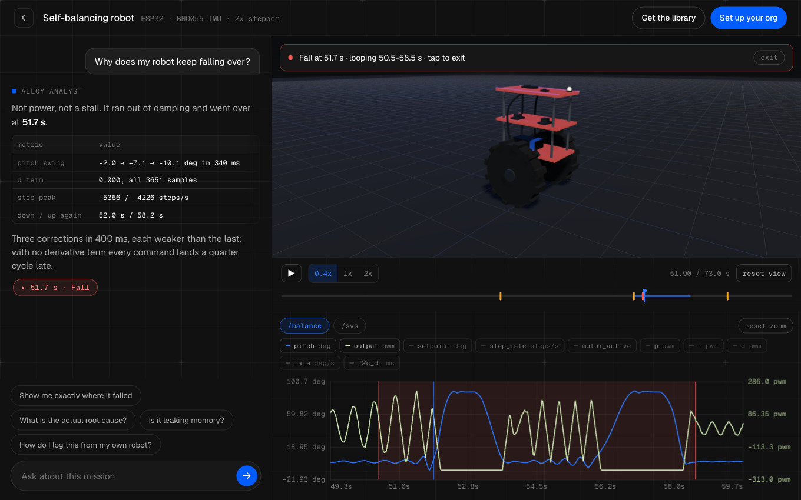

# AlloyLogger

Stream Arduino sensor and telemetry data **straight to [Alloy](https://usealloy.ai)** from an ESP32
or Arduino UNO R4 WiFi. ESP32 keeps the existing background `AlloyLogger` API; UNO R4 uses a separate
cooperative `AlloyUnoR4` adapter with typed binary capture and a fixed six-slot RAM journal. **Every
power-on lands in Alloy as one MCAP mission** for replay, inspection, SQL, and MCP analysis.

You usually don't declare anything: Alloy's AI reasons over your tag + field names + values (a
`heading` ranging 0–360 under a `bno055` tag → it's a magnetic heading). Optionally `describe()` a
field to hand Alloy units/ranges for even sharper context.

## Quick Start: confirm your first ESP32 mission

This path needs only an ESP32 and 2.4 GHz Wi-Fi. The `FirstMission` example generates its own sample
telemetry, prints each meaningful stage over Serial, and explicitly finalizes the run. No sensor or
Alloy Edge installation is involved. Arduino UNO R4 WiFi users should start with the separate
[UNO R4 guide](docs/uno-r4-wifi.md) and [starter example](examples/UnoR4Starter).

### 1. Install the library

1. Install the **esp32 by Espressif Systems** board package in Arduino IDE's Boards Manager.
2. Install **ArduinoJson** in Library Manager.
3. Download this repository as a ZIP, then choose **Sketch → Include Library → Add .ZIP Library**.
4. Open **File → Examples → AlloyLogger → FirstMission** and select your ESP32 board and port.

### 2. Create a data API key

[Create an Alloy org free](https://www.usealloy.ai/setup-org?utm_source=github&utm_medium=referral&utm_campaign=alloylogger&utm_content=readme),
then open **Dashboard → Mesh Storage → API key**. Copy the key when it is shown.

> **Credential limitation today:** Alloy currently gives the ESP32 a long-lived, org-wide data API
> key. It can read, write, and SQL-query the org's whole mesh; it is not write-only or restricted to
> one mesh path. Use a test org for your first mission, never commit the key, and rotate it if the
> sketch is shared. Path-scoped ingest keys remain a roadmap item, not part of this setup.

### 3. Change the four settings and flash

They are grouped at the top of `FirstMission.ino`:

```cpp
const char* WIFI_SSID       = "YOUR_2_4_GHZ_WIFI_NAME";
const char* WIFI_PASSWORD   = "YOUR_WIFI_PASSWORD";
const char* ALLOY_API_KEY   = "YOUR_ALLOY_DATA_API_KEY";
const char* ALLOY_MESH_PATH = "first-missions/esp32";
```

Upload the sketch and open Serial Monitor at **115200 baud**. It runs for 20 seconds. A confirmed
device-side result ends like this:

```text
[4/4] Draining uploads and finalizing the mission...
[progress] 20s / 20s | state=uploading | samples=... delivered=... queued=0 failed=0 retried=... dropped=0 dropped_rows=0 stale=0
PASS: Alloy accepted the data and acknowledged mission finalization.
```

### 4. Confirm it in Alloy

Open **Mesh Storage**, browse to `first-missions/esp32`, and open the new `.mcap` mission. Platform
indexing can take a few minutes after the ESP32's `PASS`; that message confirms the device upload and
finalization request were accepted, while the `.mcap` confirms the complete ESP32-to-Alloy path.

If Serial prints `CHECK NEEDED`, use the diagnostics rather than guessing:

| Signal | What it means | First thing to check |
|---|---|---|
| Wi-Fi timeout before `[2/4]` | The ESP32 never joined the network. | Exact SSID/password and a 2.4 GHz network. |
| `state=syncing-clock` at the end | The uploader could not obtain UTC time. | The network may block NTP; retry on another network or phone hotspot. |
| `last_status=401` or `403` | Alloy rejected the data API key. | Copy a fresh key and reflash; never paste it into Serial or an issue. |
| Negative `last_status` | Wi-Fi, DNS, TLS, or the HTTPS connection failed. | Restore the network while the board stays powered; the retained buffer keeps retrying. |
| `last_status=429` or `5xx` | Rate limit or temporary service failure. | Leave the board powered; delivery retries with bounded backoff. |
| `dropped>0` or `dropped_rows>0` | RAM backpressure forced data loss before delivery. | Wi-Fi signal; retry the low-rate example unchanged. |
| `stale>0` | Data was sent after that run had finalized. | Reset the ESP32 to begin a fresh mission. |
| Finalization not acknowledged | Metadata/data was still retrying, or a terminal loss prevented a clean boundary. | Leave the board powered when `queued>0`; use status/drop/stale counters to distinguish terminal loss. Accepted cloud data still finalizes after silence. |

Once this works, move the key into a gitignored `secrets.h` and adapt
[BasicSensor](examples/BasicSensor), [AutoCapture](examples/AutoCapture), or
[SelfBalancingRobot](examples/SelfBalancingRobot) to your real firmware.

## See it before you flash anything

[](https://alloylogger.com/demo/?src=github)

**[Open the live demo →](https://alloylogger.com/demo/?src=github)** Replay a robot mission in your
browser: pick a robot (balancer, 6-axis arm, survey quad, tracked rescue), ask the analyst why it
failed, and watch the 3D replay and telemetry jump to the exact moment it went wrong. Every number
in it came through `alloy.log()`-style channels. No account, no hardware, nothing to install.

> Verified end-to-end on real hardware: the existing ESP32 CSV path and the UNO R4 binary path both
> produced indexed MCAP missions in Alloy Mesh Storage. The UNO gate covered normal upload, WiFi
> reconnect, dropped-response retry, fixed-RAM overflow, reset-before-END, and clean post-reset capture.

```cpp
#include <AlloyLogger.h>
AlloyLogger alloy;

void setup() {
  alloy.wifi("ssid", "pass");                 // optional — omit if already connected
  alloy.begin("ALLOY_API_KEY", "robots/sbr"); // starts background upload
}

void loop() {
  alloy.log("bno055")
       .set("heading", heading)
       .set("pitch",   pitch)
       .set("roll",    roll);                  // commits at the ';'
  alloy.log("battery", volts);                 // single value
}
```

---

## Why it's nice

The bullets below describe the ESP32 path. UNO R4 deliberately uses a cooperative API documented in
[AlloyLogger on Arduino UNO R4 WiFi](docs/uno-r4-wifi.md), rather than pretending FreeRTOS background
tasks were ported to the RA4M1.

- **Self-documenting calls.** The field name sits next to its value — nothing to declare, nothing to
  keep in sync, no positional args to get wrong.
- **Non-blocking.** `log()` formats one compact CSV row on the caller's stack (one `%.6g` per
  field) and appends it to a RAM buffer under a short mutex — tens of microseconds, no network,
  no filesystem, no allocation. A background task on **core 0** does the TLS upload, so a control
  loop on core 1 is never disturbed.
- **Reliable by default.** RAM-buffered with **store-and-forward** — if WiFi drops, buffers queue and
  flush on reconnect; if the uplink can't keep up, the oldest buffer is shed (counted), never a crash.
- **Zero flash wear.** Nothing touches the filesystem, so it coexists with OTA / `min_spiffs` layouts.
- **Alloy-native.** Each run becomes one indexed `.mcap` in your mesh: Replay/Inspect, mission
  summaries, and SQL all work out of the box, plus a one-time semantics sidecar for Alloy AI.

---

## Install

**Arduino IDE:** Sketch → Include Library → Add .ZIP Library (or clone into `~/Arduino/libraries/`).
Depends on **ArduinoJson** (Library Manager).

**arduino-cli / PlatformIO:**
```bash
arduino-cli lib install ArduinoJson
# clone this repo into your libraries folder, or for a one-off build:
arduino-cli compile --fqbn esp32:esp32:esp32 --library /path/to/AlloyLogger your_sketch
arduino-cli compile --fqbn arduino:renesas_uno:unor4wifi --library /path/to/AlloyLogger your_uno_sketch
```

You need an Alloy account + a data-API key
([create an org free](https://www.usealloy.ai/setup-org?utm_source=github&utm_medium=referral&utm_campaign=alloylogger&utm_content=readme),
then Dashboard → Mesh Storage → API key). Keep the key in a gitignored `secrets.h`, not in the
sketch — see [Security](#security) for what it can do.

---

## ESP32 API

```cpp
AlloyLogger alloy;
```

**Config (all optional, before `begin`)** — each returns `*this` so you can chain:
| Call | Purpose | Default |
|---|---|---|
| `alloy.wifi(ssid, pass)` | Connect WiFi. Omit if your sketch already connected. | — |
| `alloy.device(id, firmware)` | Device id + firmware tag (into `meta.json`). | id = sketch filename (`MyRobot.ino` → `MyRobot`) |
| `alloy.mission(name)` | Human-readable label for this run, stored in the MCAP metadata. | — |
| `alloy.buffers(count, bytes)` | RAM buffer pool. Keep count above your channel count, and the total well under half the free heap (a verified TLS handshake needs ~60 KB headroom). | `4 × 12 KB` |
| `alloy.describe(channel, field, unit, min, max, about)` | Richer semantics for Alloy AI. | — |
| `alloy.insecure()` | Skip TLS verification (TLS-intercepting proxies etc.). | verify via Mozilla roots |
| `alloy.direct()` | Legacy transport: SigV4 CSV chunks straight to your mesh, no MCAP assembly. | cloud |
| `alloy.finalizeAfter(sec)` | How long after the last data the cloud declares the run over and finalizes its `.mcap`. | 2 min (server; clamped 30 s – 30 min) |
| `alloy.ingestUrl(url)` | Override the AlloyLogger Cloud endpoint. | `https://ingest.alloylogger.com` |

**Start:**
```cpp
alloy.begin(apiKey, meshPath);   // meshPath e.g. "robots/sbr"; optional 3rd arg = data URL
```

**Log:**
```cpp
alloy.log("channel").set("a", x).set("b", y);   // multi-field, commits at end of statement
alloy.log("channel", value);                     // single value (field name "value")
```
`set()` takes `float` / `int` / `double` / `bool`. Values are stored as `float` (see
[Limits & notes](#limits--notes)).

**Auto-capture (set-and-forget)** — register *once* and the library captures for you in the
background, with **no code in `loop()`**. When something unexpected happens, the data is
already there — no reflash to add a probe, no serial monitor:
| Call | Streams | Channel |
|---|---|---|
| `alloy.scope()` | **every GPIO your sketch uses** — auto-discovered from the chip's own pin config (outputs, inputs with pulls, I2C/SPI/PWM peripherals), change-driven: `gpioN` level + `gpioN_hz` toggle frequency. Fast pins (SPI clocks, steppers at speed) are summarized as frequency. Also enables heap/RSSI/uptime. | `io` + `sys` |
| `alloy.watchAnalog(pin, "name")` | an analog pin (`analogRead`) | `adc` |
| `alloy.watch("chan", "field", fn)` | any variable/expr via a captureless `float(*)()` | `chan` |
| `alloy.sampleEvery(ms)` | sampler period (default `100` = 10 Hz) | — |

```cpp
float g_pitch;  float readPitch() { return g_pitch; }   // expose a variable

alloy.scope();                              // the software oscilloscope: every configured pin
alloy.watchAnalog(34, "batt_raw");          // ADC
alloy.watch("imu", "pitch", readPitch);     // your own variable
alloy.begin(ALLOY_KEY, "demos/auto");       // register before begin()
```
`scope()` emits an `io` row only when a pin changes (plus a heartbeat every few seconds), so a
quiet board costs almost nothing. Pins configured *after* `begin()` are picked up by a periodic
re-scan. `gpioN_hz` is a measured floor — MHz buses read as "very fast", not exact. Watched fields
sharing a channel are written as one aligned row per tick — same CSV tables, same `describe()`
semantics. Mix freely with explicit `log()` calls.

**End of run (optional):**
```cpp
bool finalized = alloy.end();   // true after drain + accepted finalization (or drain in direct mode)
```
Without it, the run finalizes automatically ~2 minutes after the last data (tune with
`finalizeAfter()`; power loss is detected server-side, which is the only place it can be). `end()`
just makes the mission appear immediately, e.g. on a kill switch or at the end of a scripted test.
Once called, it establishes the final logging boundary: later `log()` and sampler rows are ignored.
It waits for the metadata request before draining data, so finalization cannot race the mission
label/field descriptions on the shared HTTPS connection. If it returns `false`, it did not finalize
ahead of an unsettled request, or metadata/data inside the boundary was terminally rejected, stale,
or dropped under backpressure. Retryable buffers remain retained; chunks already accepted by the
cloud still have the inactivity-finalization fallback.

**Readiness and delivery health:**

- `alloy.ready()` becomes true after UTC clock sync and initialization of the run identity. It does
  not by itself prove that Alloy accepted data; use the delivery counters and status below.
- `alloy.delivered()` (also available as `uploaded()`) counts accepted data chunks;
  `alloy.queued()` is a snapshot of sealed/in-flight chunks; `alloy.retried()` counts retryable
  attempts. Wi-Fi/transport errors, HTTP `408`/`425`/`429`, and `5xx` responses retain the current
  buffer and retry with bounded backoff.
- In legacy `direct()` mode, an R2 PUT `401`/`403` invalidates the temporary upload session and is
  retried once with newly minted credentials. Malformed successful upload-session responses are
  treated as retryable protocol failures rather than successful delivery.
- `alloy.failed()` counts terminal upload failures; `alloy.dropped()` counts whole buffers shed
  under RAM backpressure; `alloy.droppedRows()` counts rows that could not be buffered; and
  `alloy.stale()` counts chunks refused because the run had already finalized.
- `alloy.lastStatus()` is the most recent HTTP status or a negative local/ESP transport code.
  `alloy.lastError()` turns that status into a printable `String`; it is empty after a successful
  request. A later success therefore replaces an earlier transient error in these last-result
  diagnostics, while `retried()` remains cumulative.

## Arduino UNO R4 WiFi API

UNO R4 support is a separate fixed-memory adapter. Read board I/O explicitly, commit typed values,
and call `poll()` frequently enough to service WiFi, verified TLS, retries, ACKs, and time anchors:

```cpp
#include <AlloyUnoR4.h>
#include "arduino_secrets.h"

AlloyUnoR4 logger;
const AlloyUnoR4Field fields[] = {
  {0, alloy::device::v1::FIELD_U16, "adc_raw", "count"},
};

void setup() {
  AlloyUnoR4Config config;
  config.ssid = SECRET_WIFI_SSID;
  config.password = SECRET_WIFI_PASSWORD;
  config.api_key = SECRET_ALLOY_API_KEY;
  config.device_id = "uno-r4-01";
  config.mesh_path = "robots/bench";
  logger.begin(config);
  logger.declareSchema(1, 1, "board_io", fields, 1);
}

void loop() {
  logger.poll();
  const uint16_t adcRaw = static_cast<uint16_t>(analogRead(A0));
  logger.sample(1, 1).setU16(0, adcRaw).commit();
}
```

Capture performs fixed-capacity memory operations only. Networking is cooperative and occurs in
`poll()`, which can block within its configured WiFi/TLS bounds. The tracked example secret headers
contain empty compile-only placeholders; put real credentials only in a private working copy and
clear them before committing. See the [UNO R4 guide](docs/uno-r4-wifi.md),
[starter example](examples/UnoR4Starter), and [telemetry example](examples/UnoR4Telemetry).

---

## How it gets to Alloy

The ESP32 path streams compact **per-channel CSV chunks**: a one-line header (`t_ns` + your field
names), then bare value rows, wall-clock-timestamped so channels align with no extra math:
```csv
t_ns,temp_c,humidity
1782715694000000000,22.4,51.2
1782715695000000000,22.5,51.1
```
The header makes each ESP32 chunk **self-describing** and dropping per-row JSON keys roughly halves
the bytes versus JSON. UNO R4 instead sends bounded **Alloy Device Wire v1** binary frames with typed
schemas, CRC32C, exact duplicate/conflict semantics, clock anchors, explicit gaps/loss counters, and
an exact 48-byte ACK. See the [wire contract](docs/alloy-device-wire-v1.md).

**Why CSV on the wire, MCAP at rest?** Text CSV is a deliberate v1 choice for the device side:
you can eyeball a chunk over the serial monitor, replay one with `curl`, and a run that dies
mid-chunk still parses up to the last complete row. Nothing downstream reads it, though — the
cloud service assembles every run into a chunked, indexed **MCAP** with JSON-Schema channels, so
replay, SQL, and tooling never touch CSV.

Chunks go to **AlloyLogger Cloud** (`ingest.alloylogger.com`) over plain keep-alive HTTPS. The
service stages them and, when the run ends (`alloy.end()` or ~2 min of silence), assembles **one
indexed `.mcap`** and uploads it into *your* Alloy mesh at `<meshPath>/<session>/`, together with
the **`meta.json`** semantics sidecar built from your `describe()` calls:
```json
{ "device":"sbr-01", "firmware":"fw16", "mission":"driveway brake test", "session":"2026-06-29T06:48:14Z",
  "fields":[ {"channel":"env","name":"temp_c","unit":"degC","min":-40,"max":125,"about":"ambient temperature"} ] }
```
The optional `mission()` label is copied into the assembled MCAP's `alloy` metadata; it does not
change the device id, mesh path, or Alloy Device Wire v1 schema.
Every power-on = one mission in Alloy: replayable, inspectable, SQL-queryable, visible to
`list_missions` and the rest of the Alloy MCP surface.

**Privacy note:** in cloud mode your telemetry and API key transit the AlloyLogger Cloud service.
Chunks are staged only until the run's `.mcap` is uploaded, and the key is held for the session's
finalize step, then purged after successful delivery or bounded retry exhaustion. An authenticated
`end()` retry can rehydrate an exhausted session and rearm finalization. If you'd rather not have a
middleman, `alloy.direct()` uploads
SigV4-signed CSV chunks straight from the device to your mesh (queryable tables, but no per-run
MCAP, replay, or mission view).

---

## Examples

- **[FirstMission](examples/FirstMission)** — configure four values, stream generated data, and get
  a clear Serial pass/fail result with explicit finalization.
- **[BasicSensor](examples/BasicSensor)** — stream a sensor in ~10 lines.
- **[AutoCapture](examples/AutoCapture)** — set-and-forget: `scope()` every pin + `watch()` variables, nothing in `loop()`.
- **[SelfBalancingRobot](examples/SelfBalancingRobot)** — add streaming to a 100 Hz control loop
  without disturbing real-time stepping (the pattern for a robot that already manages WiFi).
- **[UnoR4Starter](examples/UnoR4Starter)** — finite typed run with cooperative END/ACK handling.
- **[UnoR4Telemetry](examples/UnoR4Telemetry)** — explicit board I/O, cached RSSI, and missed-tick visibility.

---

## Limits & notes

- **ESP32 sustained rate is bounded by upload throughput** (~one R2 PUT per buffer over WiFi). A few hundred
  records/sec is comfortable; far higher sheds oldest buffers (counted in `dropped()`). Tune with
  `buffers()`, or use an ESP32-S3 / better WiFi.
- **Values are `float`** (~7 significant digits). `set()` silently narrows `double`; `int` and
  `bool` are converted. Timestamps are exempt — `t_ns` is a full-width integer column.
- **`log()` is not ISR-safe.** It takes a FreeRTOS mutex — call it from tasks only, never from an
  interrupt handler. (`scope()`'s edge counting runs in its own 3-instruction IRAM ISR; it never
  calls `log()`.)
- **The library's tasks run on core 0** (uploader at priority 4, sampler at 3). Arduino `loop()`
  on core 1 is unaffected; if your sketch pins its own work to core 0, keep it below priority 4 or
  expect brief preemption during TLS writes.
- **A real UTC clock is required** (timestamps + session ids; SigV4 in direct mode) — the library
  runs SNTP automatically. Records logged
  before the first sync are stamped with a boot-relative clock and rebased to wall-clock time
  in-buffer once SNTP lands, so nothing is lost or mis-timed.
- **TLS is verified by default.** ESP32 uses its embedded Mozilla bundle and retains the explicit
  `alloy.insecure()` escape hatch. UNO R4 delegates to WiFiS3's verified public roots and has no
  insecure fallback.
- **UNO R4 is volatile best effort.** Its six 768-byte journal slots make loss and backpressure
  observable, but reset or power loss discards retained RAM and starts a new run.

## Security

- **Know what the key can do.** The key you flash is a long-lived Alloy **data-API key**: it can
  read, write, and SQL-query your whole org's mesh, not just this device's path. Treat a leaked
  key as a leak of your org's data plane, not of one robot's telemetry.
- **The device is not a vault.** MCU flash is dumpable — anyone with the board (or a sketch you
  committed) has the key. Keep it in a gitignored `secrets.h`, give each device its own key, and
  rotate on any suspicion.
- **What the cloud holds.** In cloud mode the key rides along with each request; the service keeps
  it in the session state until successful finalization or bounded retry exhaustion, then purges
  it. The temporary upload credentials it derives expire after 900 s — but that TTL covers the
  *derived* credentials, not your key. No raw storage (R2) credentials ever reach the device.
- Fine for a hobby rig today. Before putting this on a real fleet you want the write-only,
  path-scoped ingest keys on the [roadmap](#roadmap).

## Roadmap

- **Persistent UNO journal.** The current tier-1 fixed-memory profile reports loss honestly but does
  not survive reset or power loss.
- **Scoped ingest keys.** Write-only, path-scoped per-device keys, so a key pulled off a board
  can't read — or touch — anything else in the org.

## License

MIT — see [LICENSE](LICENSE).
